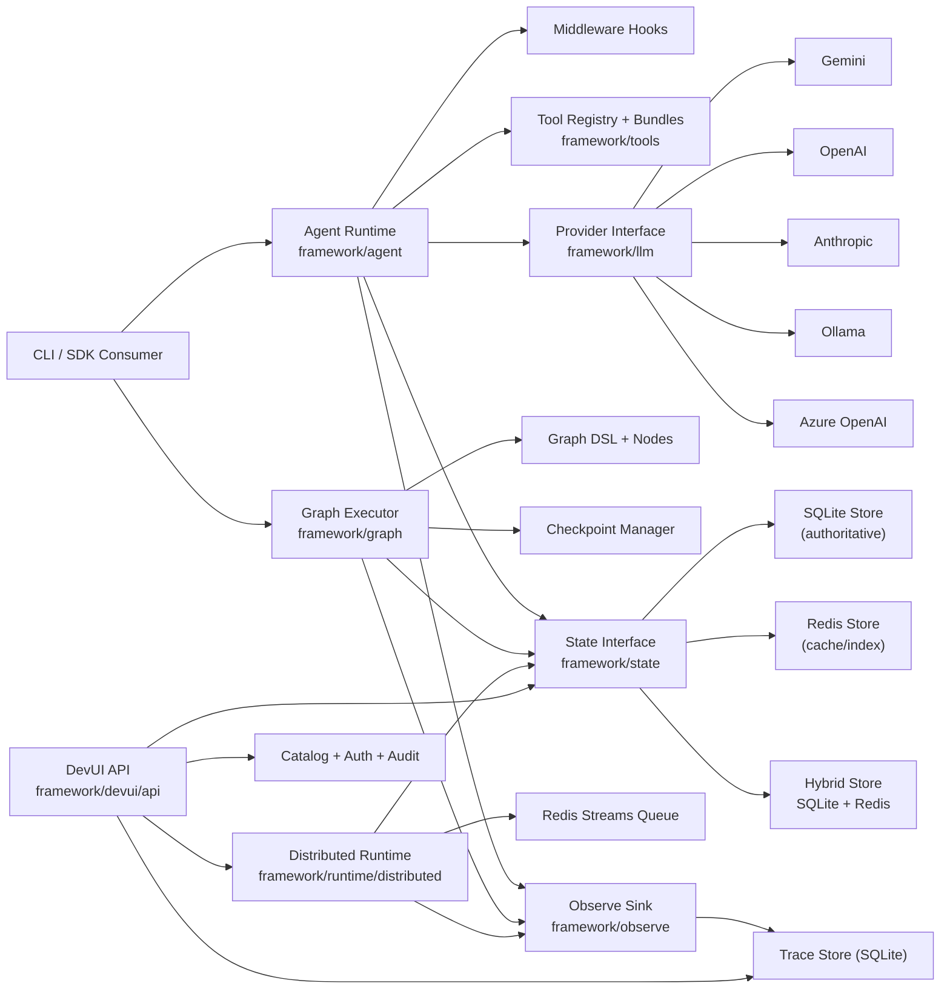

# PipeOps Agent SDK (Go)

`agent-sdk-go` is PipeOps' runtime-first, provider-agnostic framework for building production AI agents in Go.

It combines:
- Single-agent and multi-agent runtime with middleware, retries, and tool calling
- Static multi-agent graph orchestration with checkpoint + resume
- Durable state backends (SQLite, Redis, Hybrid)
- Distributed execution (coordinator + workers over Redis Streams)
- Developer UI APIs for observability, runtime ops, and tool catalog management

## What We Have Built

## Running the CLI

- Preferred entrypoint: `go run ./cmd/agent-framework <command>`
- Backward-compatible entrypoint: `go run . <command>`
- Examples:
  - `go run ./cmd/agent-framework run -- "hello"`
  - `go run ./cmd/agent-framework ui`
  - `go run ./cmd/agent-framework eval --dataset=./evals/security.jsonl --fail-under=90 --workers=4 --retries=1 --case-timeout-ms=45000 --timeout-ms=300000`
  - `go run ./cmd/agent-framework eval --dataset=./evals/security.jsonl --judge --judge-rubric="Correctness and safety" --judge-min-score=0.75`

Eval dataset notes (`.jsonl`):
- each line is a case with `input` plus optional `expectedOutput`, `requiredTools`, `forbiddenTools`, `assertions`, `tags`, `metadata`
- optional rubric scoring fields: `judgeRubric`, `minJudgeScore`
- assertions support: `contains`, `regex`, `equals`, `json_valid`, `json_schema`

### 1) Runtime Core
- Agent loop with iterative reasoning + tool invocation
- Middleware lifecycle hooks:
  - `BeforeGenerate`
  - `AfterGenerate`
  - `BeforeTool`
  - `AfterTool`
  - `OnError`
- Structured retry policy with backoff
- Additive run metadata (`RunID`, `SessionID`, events, timestamps)

### 2) Graph Orchestration
- Static Graph DSL (`framework/graph`) with compile-time validation
- Node primitives:
  - `AgentNode`
  - `ToolNode`
  - `RouterNode`
- Deterministic transitions
- Checkpoint persisted after node transitions
- `Resume(runID)` from latest checkpoint

### 3) State Layer
- Unified interface in `framework/state`
- SQLite durable store (`modernc.org/sqlite`, pure Go, no CGO)
- Redis accelerator store for hot reads/session indexing
- Hybrid store policy:
  - write: SQLite first, Redis best-effort
  - read: Redis first, fallback SQLite + backfill

### 4) Distributed Runtime
- Coordinator + Worker topology
- Redis Streams queue backend
- At-least-once task delivery
- Retry with exponential backoff and DLQ on exhaustion
- Attempt/worker/queue tracking tables:
  - `run_attempts`
  - `worker_heartbeats`
  - `queue_events`

### 5) Developer UI APIs
- Run/session/event/checkpoint inspection
- Runtime operations:
  - workers
  - queue stats
  - attempts
  - cancel/requeue
  - DLQ listing
- Tool catalog + workflow bindings
- API key + RBAC (`viewer`, `operator`, `admin`)
- Audit logs for mutation endpoints

### 6) Provider + Tool Ecosystem
- Providers:
  - Gemini
  - OpenAI
  - Anthropic
  - Ollama
  - Azure OpenAI
- Built-in tools and bundles via `framework/tools`
- Integration catalog metadata (HTTP, Slack, GitHub, Jira, PostgreSQL, Redis, S3, GCS, PagerDuty, SMTP)

### 7) Example Agents
- **Log Analyzer**: Multi-agent system for log analysis, fix generation, and PR creation
- **SecOps Agent**: Security operations with Trivy report analysis and log processing
- **Prompt Templates**: Demonstration of role-based prompt templates
- **Custom Tools**: Example of building and registering custom tools
- **Graph Resume**: Checkpoint and resume workflow patterns
- **Distributed Enqueue**: Distributed task processing examples

## Architecture



## Repository Layout

- `cmd/ai-agent-framework`: full CLI (run/graph/ui/runtime ops)
- `framework/agent`: core runtime
- `framework/graph`: graph DSL + executor
- `framework/workflow`: workflow registry + JSON loader
- `framework/state`: store interface + sqlite/redis/hybrid implementations
- `framework/runtime`: distributed runtime + queue adapters
- `framework/observe`: event model + sinks + trace store
- `framework/devui`: API server, auth, catalog, audit
- `framework/providers`: provider implementations + factory
- `framework/tools`: tools, bundles, registry
- `framework/integrations`: integration metadata + credential refs
- `framework/examples`: runnable SDK examples for common patterns

## Quick Start

### Prerequisites
- Go `1.25+`
- Redis (only required for distributed mode)
- Provider credentials or local Ollama

### 1) Configure environment
Use one of the examples:
- `.env.local.example`
- `.env.distributed.example`
- `.env.gemini.example`
- `.env.openai.example`
- `.env.azureopenai.example`
- `.env.ollama.example`

### 2) Run single-agent mode
```bash
go run ./cmd/ai-agent-framework run -- "Explain zero trust in 5 bullets"
```

### 3) Run graph mode
```bash
go run ./cmd/ai-agent-framework graph-run --workflow=basic -- "Summarize this incident"
```

Resume:
```bash
go run ./cmd/ai-agent-framework graph-resume <run-id>
```

### 4) Distributed mode
Start coordinator:
```bash
go run ./cmd/ai-agent-framework runtime-start
```

Start worker:
```bash
go run ./cmd/ai-agent-framework worker-start --worker-id=w1
```

Enqueue run:
```bash
go run ./cmd/ai-agent-framework runtime-enqueue --mode=run -- "hello"
```

### 5) DevUI APIs
Local mode:
```bash
go run ./cmd/ai-agent-framework ui --ui-open=true
```

Remote API mode:
```bash
go run ./cmd/ai-agent-framework ui-api --ui-addr=0.0.0.0:7070
```

Create admin key:
```bash
go run ./cmd/ai-agent-framework ui-admin create-key --role=admin
```

## SDK Examples

Examples are self-contained agents demonstrating different patterns:

| Example | Description |
|---------|-------------|
| `log_analyzer` | Multi-agent log analysis with PR creation |
| `secops` | Security operations (Trivy + log analysis) |
| `prompt_templates` | Role-based prompt templates |
| `agent_minimal` | Minimal agent setup |
| `agent_custom_tool` | Custom tool implementation |
| `graph_resume` | Checkpoint and resume workflows |
| `distributed_enqueue` | Distributed task processing |
| `sdk_quickstart` | Quick start template |

Run examples:
```bash
# Log analyzer - analyze logs and create PRs
go run ./framework/examples/log_analyzer analyze app.log
go run ./framework/examples/log_analyzer analyze --repo=https://github.com/org/repo app.log

# SecOps - security analysis
go run ./framework/examples/secops trivy-report.json
cat logs.txt | go run ./framework/examples/secops

# Other examples
go run ./framework/examples/agent_minimal
go run ./framework/examples/agent_custom_tool
go run ./framework/examples/prompt_templates analyst "analyze this"
go run ./framework/examples/graph_resume
go run ./framework/examples/distributed_enqueue
go run ./framework/examples/sdk_quickstart
```

See `framework/examples/README.md` for detailed documentation.

## Make Targets

- `make test`
- `make framework-test`
- `make framework-build`
- `make framework-run PROMPT="..."`
- `make framework-graph-run PROMPT="..."`
- `make framework-graph-resume RUN_ID="..."`
- `make framework-runtime-start`
- `make framework-worker-start WORKER_ID=w1`
- `make framework-runtime-enqueue PROMPT="..." MODE=run`
- `make framework-runtime-cancel RUN_ID="..."`
- `make framework-runtime-requeue RUN_ID="..."`
- `make framework-runtime-workers`
- `make framework-runtime-queues`

## Current Status

- Runtime core: implemented
- Graph orchestration + resume: implemented
- SQLite + Redis + Hybrid state: implemented
- Distributed runtime (Redis Streams): implemented
- DevUI backend + runtime ops endpoints: implemented
- Integration catalog metadata + credential refs: implemented
- Skills (Agent Skills open standard): implemented
- Guardrails (input/output validation): implemented
- Structured Output (JSON schema enforcement): implemented
- RAG (retrieval-augmented generation): implemented
- OpenTelemetry tracing: implemented
- SDK docs/examples: in progress and actively expanding

---

## Skills

Skills follow the [Agent Skills open standard](https://github.com/agent-skills) — reusable bundles of instructions + tools that augment an agent's capabilities.

### Loading Skills

Skills can be loaded from local directories or installed from GitHub:

```go
import "github.com/PipeOpsHQ/agent-sdk-go/skill"

// Load all skills from a directory
skill.LoadDir("./skills")

// Install from GitHub at runtime (via DevUI)
// POST /api/v1/skills { "repo": "owner/repo" }
```

### Skill Format (SKILL.md)

Each skill is a Markdown file named `SKILL.md`:

```markdown
---
name: code-review
description: Reviews code for bugs, security issues, and best practices
license: MIT
allowed_tools:
  - file_system
  - code_search
  - git_repo
metadata:
  author: your-org
  version: 1.0.0
---

## Instructions

You are an expert code reviewer. When reviewing code:
1. Check for security vulnerabilities
2. Look for performance issues
3. Verify error handling
4. Suggest improvements
```

### Using Skills

Skills can be attached to flows or selected in the playground:

```go
import "github.com/PipeOpsHQ/agent-sdk-go/flow"

flow.MustRegister(&flow.Definition{
    Name:   "reviewer",
    Skills: []string{"code-review"},
    Tools:  []string{"file_system", "git_repo"},
})
```

---

## Guardrails

Guardrails validate input/output before and after LLM calls to enforce safety, compliance, and quality.

### Built-in Guardrails

| Guardrail | Direction | Action | Description |
|-----------|-----------|--------|-------------|
| `max_length` | both | block | Blocks content exceeding character limit |
| `prompt_injection` | input | block | Detects prompt injection attacks |
| `content_filter` | both | block | Filters harmful content |
| `pii_filter` | both | redact | Redacts PII (SSN, CC, email, phone) |
| `topic_filter` | both | block | Restricts to allowed topics |
| `secret_guard` | both | redact | Redacts API keys and secrets |

### Usage

```go
import (
    "github.com/PipeOpsHQ/agent-sdk-go/agent"
    "github.com/PipeOpsHQ/agent-sdk-go/guardrail"
)

pipeline := guardrail.NewPipeline().
    AddInput(&guardrail.PromptInjection{}).
    Add(&guardrail.PIIFilter{}).
    Add(&guardrail.SecretGuard{})

a, _ := agent.New(provider,
    agent.WithMiddleware(guardrail.NewAgentMiddleware(pipeline)),
)
```

Guardrails are also selectable in the DevUI playground via `GET /api/v1/guardrails`.

---

## Structured Output

Force the LLM to respond with JSON matching a schema:

```go
schema := map[string]any{
    "name": "analysis",
    "schema": map[string]any{
        "type": "object",
        "properties": map[string]any{
            "sentiment": map[string]any{"type": "string", "enum": []string{"positive", "negative", "neutral"}},
            "confidence": map[string]any{"type": "number"},
            "summary":    map[string]any{"type": "string"},
        },
        "required": []string{"sentiment", "confidence", "summary"},
    },
}

a, _ := agent.New(provider, agent.WithResponseSchema(schema))
result, _ := a.Run(ctx, "Analyze: 'Great product, love it!'")
// result.Output is valid JSON: {"sentiment":"positive","confidence":0.95,"summary":"..."}
```

- **OpenAI**: Uses native `response_format.json_schema`
- **Anthropic**: Injects schema constraint into system prompt
- **Validation**: Agent retries if response is not valid JSON

---

## RAG (Retrieval-Augmented Generation)

Augment agent context with relevant documents from a vector store.

### In-Memory Store

```go
import "github.com/PipeOpsHQ/agent-sdk-go/rag"

store := rag.NewMemoryStore()
store.Add(ctx, []rag.Document{
    {ID: "1", Content: "Go uses goroutines for concurrency", Embedding: vec1},
    {ID: "2", Content: "Python uses asyncio", Embedding: vec2},
})
```

### As Middleware (automatic context injection)

```go
retriever := &rag.SimpleRetriever{Embedder: myEmbedder, Store: store}
mw := rag.NewAgentMiddleware(retriever, rag.WithTopK(3))

a, _ := agent.New(provider, agent.WithMiddleware(mw))
```

### As Tool (agent-driven retrieval)

```go
tool := rag.NewSearchTool(retriever, 5)
a, _ := agent.New(provider, agent.WithTool(tool))
```

### Custom Embedder

Implement the `rag.Embedder` interface:

```go
type Embedder interface {
    Embed(ctx context.Context, text string) ([]float64, error)
    EmbedBatch(ctx context.Context, texts []string) ([][]float64, error)
}
```

---

## OpenTelemetry

Bridge agent events to any OTel-compatible backend (Jaeger, Zipkin, Grafana):

```go
import (
    "github.com/PipeOpsHQ/agent-sdk-go/observe/otel"
    sdktrace "go.opentelemetry.io/otel/sdk/trace"
)

tp := sdktrace.NewTracerProvider(/* your exporter */)
sink := otel.NewSink(tp)

a, _ := agent.New(provider, agent.WithObserver(sink))
```

Span naming: `agent.run`, `agent.llm.{provider}`, `agent.tool.{name}`, `agent.graph.{name}`, `agent.checkpoint`.
