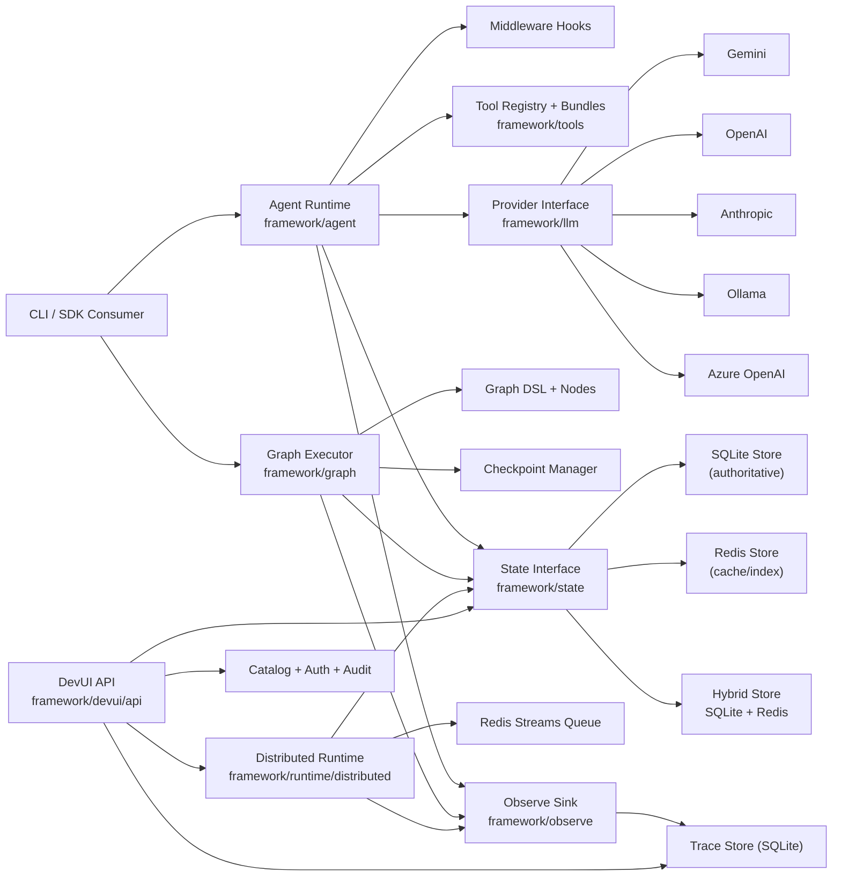

# PipeOps Agent SDK (Go)

`agent-sdk-go` is PipeOps' runtime-first, provider-agnostic framework for building production AI agents in Go.

It combines:
- A single-agent runtime with middleware, retries, and tool calling
- Static multi-agent graph orchestration with checkpoint + resume
- Durable state backends (SQLite, Redis, Hybrid)
- Distributed execution (coordinator + workers over Redis Streams)
- Developer UI APIs for observability, runtime ops, and tool catalog management

## What We Have Built

### 1) Runtime Core
- Agent loop with iterative reasoning + tool invocation
- Middleware lifecycle hooks:
  - `BeforeGenerate`
  - `AfterGenerate`
  - `BeforeTool`
  - `AfterTool`
  - `OnError`
- Structured retry policy with backoff
- Additive run metadata (`RunID`, `SessionID`, events, timestamps)

### 2) Graph Orchestration
- Static Graph DSL (`framework/graph`) with compile-time validation
- Node primitives:
  - `AgentNode`
  - `ToolNode`
  - `RouterNode`
- Deterministic transitions
- Checkpoint persisted after node transitions
- `Resume(runID)` from latest checkpoint

### 3) State Layer
- Unified interface in `framework/state`
- SQLite durable store (`modernc.org/sqlite`, pure Go, no CGO)
- Redis accelerator store for hot reads/session indexing
- Hybrid store policy:
  - write: SQLite first, Redis best-effort
  - read: Redis first, fallback SQLite + backfill

### 4) Distributed Runtime
- Coordinator + Worker topology
- Redis Streams queue backend
- At-least-once task delivery
- Retry with exponential backoff and DLQ on exhaustion
- Attempt/worker/queue tracking tables:
  - `run_attempts`
  - `worker_heartbeats`
  - `queue_events`

### 5) Developer UI APIs
- Run/session/event/checkpoint inspection
- Runtime operations:
  - workers
  - queue stats
  - attempts
  - cancel/requeue
  - DLQ listing
- Tool catalog + workflow bindings
- API key + RBAC (`viewer`, `operator`, `admin`)
- Audit logs for mutation endpoints

### 6) Provider + Tool Ecosystem
- Providers:
  - Gemini
  - OpenAI
  - Anthropic
  - Ollama
  - Azure OpenAI
- Built-in tools and bundles via `framework/tools`
- Integration catalog metadata (HTTP, Slack, GitHub, Jira, PostgreSQL, Redis, S3, GCS, PagerDuty, SMTP)

### 7) Migration/Parity Path
- Domain extraction in `app/secops`
- Adapter + graph implementation for secops flow
- Parity tests against sample data

## Architecture



## Repository Layout

- `cmd/ai-agent-framework`: full CLI (run/graph/ui/runtime ops)
- `framework/agent`: core runtime
- `framework/graph`: graph DSL + executor
- `framework/workflow`: workflow registry + JSON loader
- `framework/state`: store interface + sqlite/redis/hybrid implementations
- `framework/runtime`: distributed runtime + queue adapters
- `framework/observe`: event model + sinks + trace store
- `framework/devui`: API server, auth, catalog, audit
- `framework/providers`: provider implementations + factory
- `framework/tools`: tools, bundles, registry
- `framework/integrations`: integration metadata + credential refs
- `framework/examples/sdk_quickstart`: SDK usage example

## Quick Start

### Prerequisites
- Go `1.25+`
- Redis (only required for distributed mode)
- Provider credentials or local Ollama

### 1) Configure environment
Use one of the examples:
- `.env.local.example`
- `.env.distributed.example`
- `.env.gemini.example`
- `.env.openai.example`
- `.env.azureopenai.example`
- `.env.ollama.example`

### 2) Run single-agent mode
```bash
go run ./cmd/ai-agent-framework run -- "Explain zero trust in 5 bullets"
```

### 3) Run graph mode
```bash
go run ./cmd/ai-agent-framework graph-run --workflow=basic -- "Summarize this incident"
```

Resume:
```bash
go run ./cmd/ai-agent-framework graph-resume <run-id>
```

### 4) Distributed mode
Start coordinator:
```bash
go run ./cmd/ai-agent-framework runtime-start
```

Start worker:
```bash
go run ./cmd/ai-agent-framework worker-start --worker-id=w1
```

Enqueue run:
```bash
go run ./cmd/ai-agent-framework runtime-enqueue --mode=run -- "hello"
```

### 5) DevUI APIs
Local mode:
```bash
go run ./cmd/ai-agent-framework ui --ui-open=true
```

Remote API mode:
```bash
go run ./cmd/ai-agent-framework ui-api --ui-addr=0.0.0.0:7070
```

Create admin key:
```bash
go run ./cmd/ai-agent-framework ui-admin create-key --role=admin
```

## SDK Example

Run the SDK quickstart:
```bash
go run ./framework/examples/sdk_quickstart
```

It demonstrates:
- provider setup
- state + observer wiring
- single-agent `RunDetailed`
- static graph execution

## Make Targets

- `make test`
- `make framework-test`
- `make framework-build`
- `make framework-run PROMPT="..."`
- `make framework-graph-run PROMPT="..."`
- `make framework-graph-resume RUN_ID="..."`
- `make framework-runtime-start`
- `make framework-worker-start WORKER_ID=w1`
- `make framework-runtime-enqueue PROMPT="..." MODE=run`
- `make framework-runtime-cancel RUN_ID="..."`
- `make framework-runtime-requeue RUN_ID="..."`
- `make framework-runtime-workers`
- `make framework-runtime-queues`

## Current Status

- Runtime core: implemented
- Graph orchestration + resume: implemented
- SQLite + Redis + Hybrid state: implemented
- Distributed runtime (Redis Streams): implemented
- DevUI backend + runtime ops endpoints: implemented
- Integration catalog metadata + credential refs: implemented
- SDK docs/examples: in progress and actively expanding
